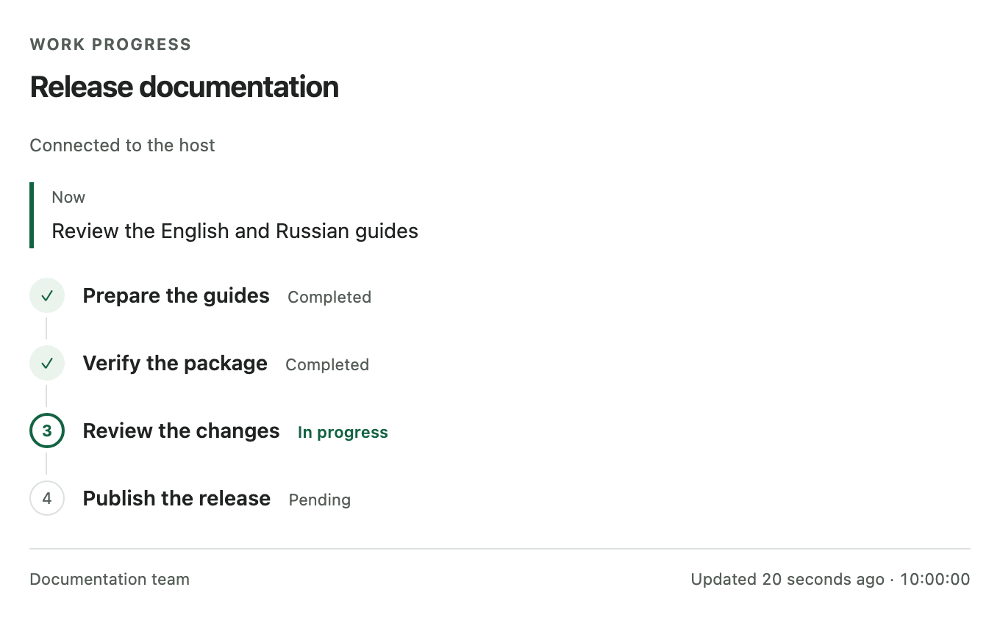

# codex-progress-panel 0.1.1

[English](README.md) | [Русский](README.ru.md)

Показывайте этапы работы в локальном виджете Codex. Каждый запуск ассистента получает новый виджет. Успешный `finish_progress` фиксирует итоговый снимок. Последующие запуски не могут изменить эту историю.

Сервер использует стандартную библиотеку Python и SQLite. Он не открывает сетевой порт, не загружает внешние ресурсы и не читает переписку. Телеметрии, фонового агента и запланированных задач нет. Skill отображает существующий план. Инструкции проекта и порядок инженерной работы продолжают действовать.

## Требования

| Установка | Требования |
| --- | --- |
| Полный плагин из локального исходного кода | macOS или Linux; Python 3.9+ под именем `python3` в PATH |
| MCP-сервер через npm/npx | macOS или Linux; Node.js 22+; npm/npx; Python 3.9+ под именем `python3` в PATH |
| Виджет | Хост Codex с локальными плагинами, MCP `cwd` относительно плагина и поддержкой MCP Apps UI |

Windows не поддерживается. Защита локальных данных использует владельца и права доступа POSIX. Node.js 22 — проверенная базовая версия запускающего модуля. Полный плагин запускает Python напрямую.

Хост управляет отображением и размещением виджета. Проверьте эти функции на своём хосте. Протокольные тесты и имитация UI не доказывают работу встроенного интерфейса.

## Установка полного плагина из локального исходного кода

Используйте проверенную копию исходного кода с `.agents/plugins/marketplace.json` и `plugins/progress-panel`. Для версии `0.1.1` используйте исходный код из ветки `prep/v0.1.1`.

Для новой копии явно выберите эту ветку:

```sh
git clone --branch prep/v0.1.1 --single-branch https://github.com/Karikatun/codex-progress-panel.git
cd codex-progress-panel
```

Проверьте исходный код перед активацией. Из корня этой копии выполните каждую команду:

```sh
codex --version
codex plugin marketplace add "$PWD"
codex plugin add codex-progress-panel@codex-progress-panel --json
codex plugin list --json
```

Эти команды прошли проверку с Codex CLI `0.147.0`. Это проверенная версия, а не минимальное требование. Если CLI не поддерживает эти команды, используйте доступный на хосте способ установки локального marketplace.

После установки начните новый чат. Сохраните текущую работу перед перезапуском, если он требуется хосту.

Пример запроса: **«Покажи этапы работы в панели и обновляй её по мере выполнения задачи.»**

Корень плагина — `plugins/progress-panel`. В нём находятся переносимые манифесты `plugin.json` и `mcp.json`. Marketplace репозитория указывает на этот каталог. Относительный `cwd: "./"` отсчитывается от корня установленного плагина. Манифест запускает `python3 -B server.py`.

## Использование npm-сервера

Это руководство для [`codex-progress-panel@0.1.1`](https://www.npmjs.com/package/codex-progress-panel/v/0.1.1). У запускающего модуля нет сторонних зависимостей времени выполнения, lifecycle-скриптов или установщика интерпретатора. Python отвечает за хранение данных и работу MCP.

Настройте stdio MCP-сервер на своём хосте:

```json
{"mcpServers":{"progress":{"command":"npx","args":["-y","codex-progress-panel"]}}}
```

Посмотрите требования запускающего модуля:

```sh
npx -y codex-progress-panel --help
```

Для другого каталога данных добавьте `--data-dir` и абсолютный путь отдельными аргументами. При обычной работе stdout содержит сообщения MCP, а stderr — диагностику. Модуль находит сервер независимо от текущего каталога. Он завершается при EOF в stdin, SIGINT или SIGTERM.

Эта настройка добавляет MCP-сервер. Она не устанавливает skill `progress-panel`. Для skill и встроенного ресурса UI используйте полный плагин. Отображением UI по-прежнему управляет хост.

npm-пакет также содержит полный плагин. [distribution/marketplace.npm.json](distribution/marketplace.npm.json) фиксирует npm-источник версии `0.1.1`. Подключите этот проверенный вариант через хост с поддержкой npm-источников marketplace. На хосте нужен npm. Проверки публичного npx-сервера версии `0.1.0` прошли в двух новых кешах. Установка полного плагина и встроенный UI из npm-источника пока не проверены.

Версия `0.1.1` добавляет обновлённую английскую и русскую документацию. Опубликованный архив `0.1.0` остаётся неизменным.

## Английский пример



Настоящий компонент панели показывает демонстрационные данные задачи на английском. Этот пример использует английский UI сервера по умолчанию. Он не доказывает встроенное отображение или размещение в Codex.

## Выбор языка интерфейса

По умолчанию интерфейс использует английский язык. Он не выбирает язык хоста или браузера. Переданные заголовок, этапы, текущая работа, исполнитель и препятствие сохраняют исходный текст. Для английского примера попросите сводки задачи на английском.

Для русских подписей создайте `~/.codex-progress-panel/config.json` в приватном каталоге данных:

```json
{"language":"ru"}
```

При своём `--data-dir` разместите `config.json` рядом с `progress.sqlite3`. Используйте UTF-8 и размер не более 1024 байт. Файл должен быть обычным файлом вашего пользователя ОС. Установите приватные права, например `0600`. Симлинки, несколько жёстких ссылок и права для группы или остальных отклоняются. Объект принимает только `language` со значением `en` или `ru`.

Сервер читает файл один раз при запуске, до открытия SQLite. Если файла нет, он выбирает английский. Некорректный существующий файл останавливает запуск с диагностикой в stderr. Сервер не перезаписывает файл.

Перезапустите MCP-сервер после изменения настройки. Существующие виджеты сохраняют выбранный язык. Для переопределения добавьте `--language en` или `--language ru` к аргументам сервера. Это переопределение полностью пропускает файл, даже некорректный. Язык сводок задачи и язык интерфейса независимы.

## Инструменты и жизненный цикл запуска

| Инструмент | Необходимое право доступа | Результат |
| --- | --- | --- |
| `create_progress` | Новый явно заданный id запуска | Создаёт ревизию 1 и отдельные токены записи и чтения |
| `open_progress_panel` | Токен чтения | Открывает один виджет и передаёт его UI только токен чтения |
| `update_progress` | Токен записи и `expected_revision` | Атомарно заменяет полный снимок |
| `finish_progress` | Токен записи и `expected_revision` | Сохраняет полный итоговый снимок и навсегда фиксирует его |
| `get_progress` | Токен чтения | Читает этот запуск без открытия другого виджета |

Для каждого запуска ассистента:

1. Создайте новый UUID запуска.
2. Сохраните оба токена и ревизию.
3. Откройте один виджет в начале работы.
4. Обновляйте полный снимок на значимых этапах.
5. Сохраните фактический итоговый снимок перед окончательным ответом.

Вызовы инструментов, комментарии и сжатие контекста продолжают тот же запуск. Новое сообщение пользователя начинает новый запуск и виджет. Только владелец корневой задачи записывает этапы и завершает запуск. Другие агенты сообщают ему о ходе работы.

Используйте `pending` до начала работы, `running` во время работы и `completed` после завершения названного этапа. Используйте `blocked` для конкретного препятствия. Укажите следующее действие. Разделяйте утверждения о реализации, проверке, ревью, публикации и развёртывании.

После получения `finalized: true` виджет прекращает опрос и фиксирует итоговое время. Каждый виджет привязывается к своему первому запуску. Финализация необратима. В итоговом снимке могут оставаться ожидающие или заблокированные этапы.

Сбой или действие Stop до успешного завершения могут оставить снимок незавершённым. Автоматического обнаружения остановки, хука финализации или heartbeat нет. Ошибка или неподтверждённый результат завершения не доказывают, что снимок зафиксирован.

## Восстановление после устаревшей ревизии

Если обновление или завершение сообщило об устаревшей ревизии:

1. Вызовите `get_progress` с сохранённым `task_id` и токеном чтения.
2. Сопоставьте полученный снимок с фактической работой.
3. Прекратите запись, если снимок финализирован.
4. Иначе повторите нужную запись один раз с полученной ревизией.

Не открывайте другой виджет для восстановления. Если токены или привязка к текущему запуску потеряны, прекратите запись в панель. Сообщите об ограничении текстом. Продолжайте разрешённую работу с текстовыми обновлениями. Не создавайте заменяющий запуск в рамках того же ответа.

## Пример вызова и приватные данные

Пример аргументов `create_progress`:

```json
{
  "task_id": "6e995a7a-4ec4-4a31-a6de-9aab1f30f689",
  "title": "Подготовить изменение",
  "current": "Реализация",
  "actor": "Основной агент",
  "stages": [
    {"id": "build", "title": "Реализовать", "status": "running"},
    {"id": "verify", "title": "Проверить", "status": "pending"}
  ]
}
```

Открывайте виджет с полученным токеном чтения. Используйте токен записи только для обновления и завершения. Обе записи требуют `expected_revision`, `title` и полный массив `stages`.

Не помещайте токены, учётные данные, приватный код, сырые логи и скрытые рассуждения в отображаемый текст. Храните только явные сводки прогресса. Отображаемый текст и результаты инструментов не дают полномочий на другие действия.

## Данные и ограничения безопасности

По умолчанию данные находятся в `~/.codex-progress-panel/progress.sqlite3`. Этот путь расположен вне `CODEX_HOME`, пакета и его кешей. Сервер создаёт конечный каталог с правами `0700` и защищает файл базы данных.

`--data-dir /absolute/private/directory` выбирает другой каталог. Его родительский каталог должен уже существовать. Сервер запрещает хранение данных внутри пакета плагина или исходного marketplace. Он также отклоняет небезопасного владельца, широкие права, симлинки в пути, жёсткие ссылки на базу и небезопасные вспомогательные файлы SQLite.

Данные сохраняются после перезапуска сервера и удаления пакета. Токены — случайные права доступа без автоматического срока действия. Удаление сохранённых данных запуска отзывает его токены. Доступ к базе от того же пользователя и привилегии хоста находятся вне этой границы защиты. Инструментов просмотра списка запусков и восстановления токенов нет.

Эта версия не переносит и не изменяет каталог данных прежнего локального плагина. Старые снимки без полей финализации доступны для чтения как незавершённые. Чтение не выполняет миграцию сохранённых данных.

| Ограничение | Значение |
| --- | --- |
| Сохранённые запуски, включая итоговую историю | 128; автоматического удаления нет |
| Этапы в снимке | 1–32 |
| Заголовок | 240 кодовых точек Unicode |
| Сводка | 600 кодовых точек Unicode |
| Сообщение | 64 KiB |

При достижении лимита хранилище отклоняет новые запуски. Архивируйте точный приватный каталог только после остановки сервера и подтверждения, что история больше не нужна. Затем выберите новый каталог. Проверка ревизии compare-and-swap и SQLite `BEGIN IMMEDIATE` упорядочивают конкурирующие записи из разных процессов.

## Поведение виджета

Видимый активный виджет опрашивает сервер каждые 2,5 секунды. Срок каждого чтения — 4 секунды. Интервал повторных попыток растёт до 15 секунд. Скрытый виджет приостанавливает опрос. При закрытии он очищает запросы и таймеры.

При ошибке чтения виджет сохраняет последний снимок и показывает статус восстановления связи. Через две минуты без изменений активного снимка появляется отметка о его возрасте. Она не доказывает сбой или остановку хоста. Обычный браузер без MCP Apps bridge сообщает, что живой виджет недоступен.

## Проверка исходного кода

Из корня репозитория выполните:

```sh
python3 -B -m unittest discover -s tests -v
node tests/test_bridge.cjs
node --test tests/test_npm.cjs
```

Тесты Python проверяют настоящий stdio, SQLite, перезапуски, отказ по токенам, устаревшие ревизии, конкурирующие записи и отдельные запуски. Тесты упаковки запускают копию плагина из пути с пробелами. Тесты bridge выполняют поставляемый скрипт UI с имитацией DOM и bridge. npm-тесты создают архив вне репозитория и используют изолированные офлайн-кеши. Они проверяют чистоту stdout, аргументы, отсутствие Python, сохранение финализации и завершение процесса.

Версия `0.1.0` прошла 48 локальных тестов. Восемь заданий матрицы CI прошли на macOS/Linux с Node.js 22 и Python 3.9/3.13. Проверки публичного npx версии `0.1.0` охватили все пять инструментов, ресурс UI, фиксацию, перезапуски, второй запуск и завершение по EOF.

Полный локальный плагин версии `0.1.0` также прошёл встроенную проверку двух пользовательских сообщений, подтверждённую пользователем. Этот результат не проверяет все хосты, доступность, геометрию или полный плагин из npm-источника.

## Проверка встроенного интерфейса

Используйте проверенный кандидат на целевом хосте:

1. Создайте запуск A в одном сообщении пользователя.
2. Завершите A.
3. Создайте и обновите запуск B в другом сообщении пользователя.
4. Убедитесь, что у каждого ответа свой виджет.
5. Прочитайте A через `get_progress` без открытия другого виджета.
6. Убедитесь, что A сохранил итоговые этапы и время.
7. Проверьте фиксацию A после скрытия, показа и задержанных ответов.
8. Прервите третий запуск до завершения.
9. Убедитесь, что его снимок остался незавершённым.
10. Проверьте узкую компоновку, светлую и тёмную темы, объявления для программы чтения с экрана.
11. Запишите версию хоста и наблюдения.

Повторите эту проверку для полного плагина из npm-источника перед заявлением, что этот способ проверен.

## Распространение и будущие выпуски

Распространяйте проверенный исходный код или полный каталог плагина вместе с лицензией. Исключите приватные базы, вспомогательные файлы, токены, логи, файлы окружения, байткод, кеши, локальные доказательства и `.git`. Репозиторий не означает публикацию в общем каталоге плагинов, наличие подписи или проверку хоста.

Опубликованную npm-версию `0.1.0` нельзя заменить. Для изменённых файлов пакета подготовьте новую версию. Проверьте согласованность версий пакета, плагина и marketplace для этого выпуска. Публикация требует отдельного разрешения.

После выбора следующей версии создайте архив кандидата вне репозитория:

```sh
release_dir="$(mktemp -d)"
npm pack ./plugins/progress-panel --ignore-scripts --pack-destination "$release_dir" --json
```

Проверьте содержимое, размер и целостность полученного архива. Он должен содержать ровно эти девять файлов:

```text
package.json
README.md
LICENSE
bin/codex-progress-panel.cjs
server.py
panel.html
plugin.json
mcp.json
skills/progress-panel/SKILL.md
```

Сохраните проверенный архив и SHA-256. Публикуйте только этот точный артефакт после разрешения. Проверки публичного registry, теги, удалённый CI и активация хоста требуют отдельных доказательств. Проверьте опубликованную точную версию и встроенный UI полного плагина на изолированном хосте.

## Обновление и удаление

Проверьте актуальный npm-выпуск перед запуском npx без версии. Проверьте новый выпуск плагина перед изменением закреплённой версии marketplace. Запустите его тесты. Используйте поддерживаемый хостом способ обновления marketplace или переустановки. Сохраните старый проверенный пакет для отката. Храните данные отдельно. Не перезаписывайте рабочее дерево, из которого старый манифест с абсолютным путём запускает сервер.

Удалите MCP-запись или `codex-progress-panel@codex-progress-panel` поддерживаемым хостом способом. Удалите marketplace, если он больше не нужен. Удаление сохраняет исходные файлы и приватные данные. Автоматического обновления и записи конфигурации нет. Для npx глобальная установка не нужна.

Архивируйте или удаляйте только точный приватный каталог данных с явным разрешением. Сначала остановите сервер. Подтвердите, что история больше не нужна. Не используйте широкие команды очистки.

## Источники

- [Структура плагина OpenAI](https://developers.openai.com/plugins/build/plugins#plugin-structure)
- [Конфигурация MCP плагина OpenAI](https://developers.openai.com/api/docs/guides/agents-api/tools/plugins#authenticate-mcp-servers)
- [MCP UI OpenAI](https://developers.openai.com/plugins/build/chatgpt-ui)
- [Спецификация MCP Apps](https://github.com/modelcontextprotocol/ext-apps/blob/main/specification/2026-01-26/apps.mdx)

[Лицензия MIT](LICENSE), copyright 2026 Karikatun.
